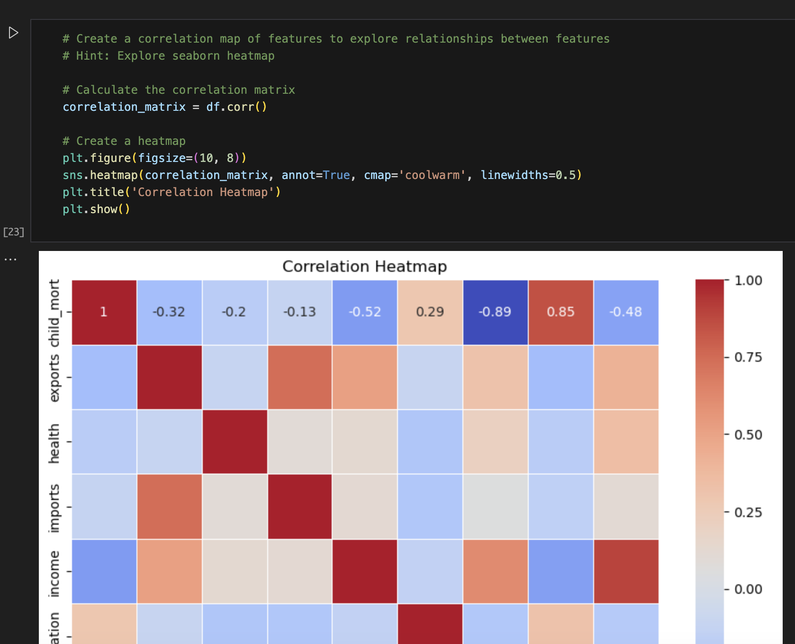
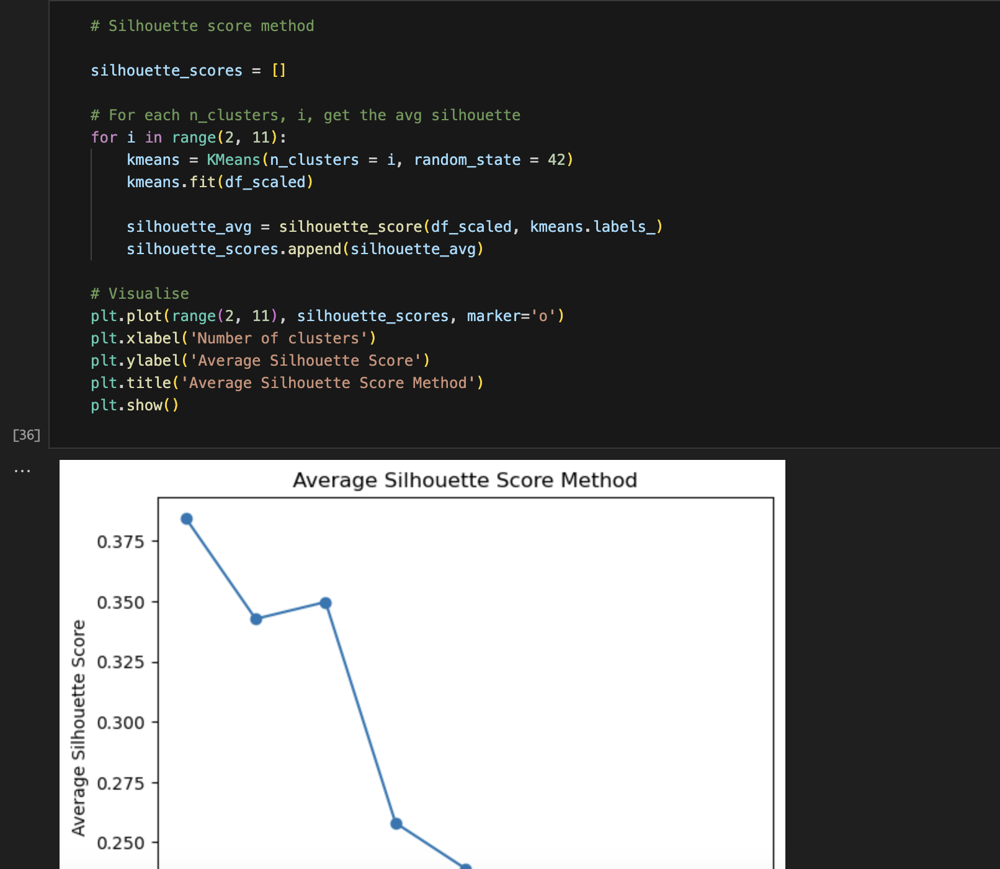
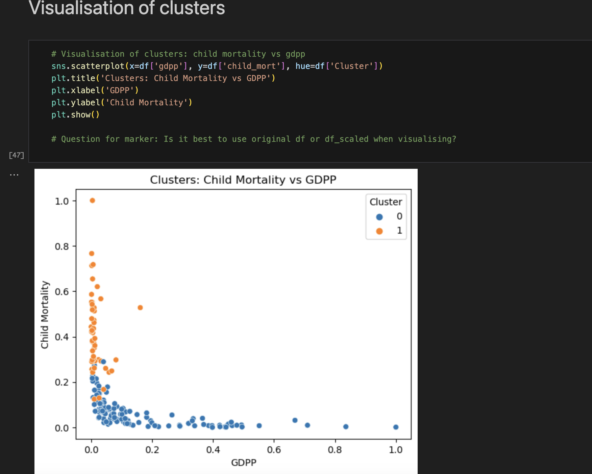

# codingTasks: KMeans Task


## Description
This coding task aims to group countries using socio-economic and health factors to determine their development status. It utilises the K-Means clustering algorithm and references a dataset called 'Country-data', originally sourced from Help.NGO. This task is important for learning about clustering techniques and application to real-world scenarios.


## Table of Contents
- [Description](#description)
- [Installation](#installation)
- [Usage](#usage)
- [Credits](#credits)


## Installation
#### To run this code locally, ensure you have Jupyter Notebook installed. You can install Jupyter using pip if you don't have it installed already:
```bash
pip install notebook
```

#### Additionally, you'll need the following Python libraries:
- pandas

- numpy

- matplotlib

- seaborn

- scikit-learn

- missingno

#### You can install these using pip:
```bash
pip install pandas numpy matplotlib seaborn scikit-learn missingno
```


## Usage

#### 1. Clone the repository to your local machine:
```
git clone https://github.com/kitsunemouton/codingTasks.git
cd codingTasks
```

#### 2. Download the dataset 'Country-data.csv' from the following link and place it in the cloned repository folder:
(https://www.kaggle.com/datasets/manusmitajha/countrydatacsv)


#### 3. Open Jupyter Notebook:
```
jupyter notebook Kmeans_task.ipynb
```

#### 4. Run the cells in the notebook to see the K-Means clustering in action. The notebook contains detailed explanations and visualisations.

#### 5. Here are some screenshots of the program in action:








## Credits
Author: Suzanne Mouton, supported by CoGrammer & HyperionDev.
